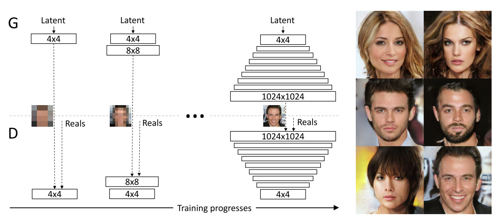
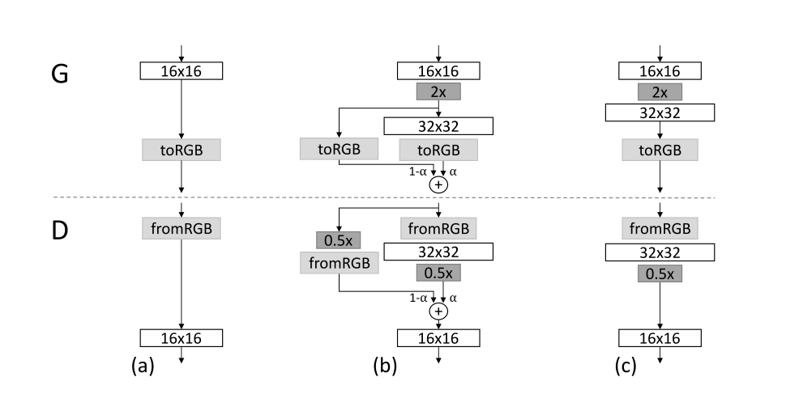
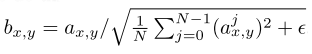

[[project](https://research.nvidia.com/publication/2017-10_Progressive-Growing-of)] [[paper](https://arxiv.org/abs/1710.10196)] [[code](https://github.com/tkarras/progressive_growing_of_gans)] [[video](https://www.youtube.com/watch?v=G06dEcZ-QTg&feature=youtu.be)]

# Progressive Growing of GANs for Improved Quality, Stability and Variation
**Tero Karras, Timo Aila, Samuli Laine, Jaakko Lehtinen**
 
 
Four main contributions:
- New training methodology for generative adversarial networks, where both the discriminator and the generator grow progressively.
- A simple way to increase variation in generated images.
- Several implementation details that are important for discouraging unhealthy competition between generator and discriminator.
- New metric for evaluating results.

#### Progressive growing of GANs
- The incremental nature of the training allows the generator to first discover large scale structures on the image distribution, and then shift attention to finer details.
- Generator and discriminator are mirror images of each other.
- Progressive growing has several benefits:
  - Early in the training, the generation of images is substantially more stable (due to the lower resolution &rarr; lower dimensional space) because there is less information and fewer modes.
  - By increasing resolution little by little, the network is constantly faced with a little more difficult task than the previous one. E.g. switch from 32x32 to 64x64 is easier than train the network on 64x64 images from scratch. Every subsequent task is simpler compared to the end goal of discovering a mapping from latent space to HD images. _Divide et impera_
  - Most of the iterations are done at low resolution, and comparable results quality (using as a baseline a non-growing model) is obtained 2-6 times faster (the greater the resolution, the more the speedup).
- The scaling of the network to a higher resolution is done by fade new layers in smoothly.

(a) the network that operates on 16x16 images. (b) during transaction from 16x16 to 32x32 the new layers are treated as residual blocks, whose weight &alpha; increase linearly from 0 to 1. The image resolution is doubled or halved using neighbor filtering and average pooling respectively. During a resolution translation the model _interpolates_ between two images at the same resolution. (c) the model that operates on 32x32 images.
  - How much iterations are required in the (b) phase?
  - The network is fine tuned at the new resolution in the (c) phase?

#### Increasing variation using minibatch standard deviation
- Variation is commonly increased by minibatch discrimination ([paper](https://arxiv.org/abs/1606.03498), [useful blog post](https://www.inference.vc/understanding-minibatch-discrimination-in-gans/)), but this approach is difficult.
- The proposed method drastically simplify the minibatch discrimination approach, also improving variation of generated samples.

Algorithm:

1. Compute the standard deviation along all the images in the batch, obtaining a batch with standard deviation of every pixel of every channel.
2. Compute the standard deviation across all channels, in order to get a single feature map of standard deviation for that pixel.
3. Compute the standard deviation for all pixels of the feature map, to get a single scalar value.
4. Replicate the value in a single channel matrix (W*H) and concatenate it to the minibatch, yielding one additional feature map.

The calculation performs better if it's done in the last layers of the discriminator. The additional feature map gives an estimation of the variance of the minibatch &rarr; the  higher the variance, the best the performance of the model (no mode collapse in similar patterns).

#### Normalization in generator and discriminator
The aim is to discourage unhealthy competition between generator and discriminator. E.g. it is observed that mode collapse tend to happen very quickly in training, over a course of a dozen of minibatches. Mode collapse starts when the discriminator overshoot, leading to exaggerated gradients, staring an unhealthy competition where the signal magnitudes escalate in both networks (in early phases of training the discriminator is highly advantaged, since the manifolds where real and fake data reside can be separated trivially, especially if the space is highly dimensional).

- Equalized learning rate
  - A trivial _N_(0,1) is used as weight initialization, and the weights are scaled at runtime. The new weighs are set as w&#770;i = wi/c where c is the per-layer normalization constant from the He weight initializer ([paper](https://arxiv.org/abs/1502.01852), [useful blog post](https://towardsdatascience.com/weight-initialization-techniques-in-neural-networks-26c649eb3b78)).
  - c = &radic;(2/fan_in), where fan_in is the number of input connection of the layer.
  - Doing this initialization is beneficial, and related to the scale-invariant SGD &larr; often the learning rate is too big and too small at the same time (the mainly used optimized RMSProp and Adam normilize a gradient update by its estimated standard deviation, making the update independent of the scale of the parameter. However, if some parameters have a larger dynamic range than others, they'll take more time to adjust). Using this approach lead to the same _learning speed_ for all the parameters.
- Pixelwise feature vector normalization in generator
  - Feature vectors of each pixel in the generator (after each convolutional layer) are normalized to unit length, using the following formula:
  
  where: &epsilon; = 10-8 ax,y is the value of the pixel (x,y) bx,y is the new value N is the number of feature maps (channels)
  - This normalization does not change the results much, but prevents the escalation of the gradient very effectively when needed.

#### Multiscale statistical similarity for assessing GAN results.
- Intuition &rarr; the generator should produce images similar to the real images (at the level of image structure) over all scales.
- The aim is to study this correlation, considering the multiscale statistical similarity between distributions of local image patches drawn from Laplacian pyramid, starting from 16x16 to full resolution.
- 16.384 images (16.384 are the real images, the fake images or the sum of the two?) are randomly chosen, and 128 descriptors are extracted from each Laplacian pyramid level (~2.1M descriptors per level). A descriptor is a 7x7 pixel neighborhood, with 3 color channels.
- Each descriptor of every layer is normalized with the mean and the standard deviation of each color channel, and then the statistical similarity is computed using the sliced Wasserstein distance (SWD) ([paper](https://link.springer.com/chapter/10.1007/978-3-642-24785-9_37), [useful blog post](http://www.numerical-tours.com/matlab/optimaltransp_4_matching_sliced/)).
- A small Wasserstein distance indicates that the distribution of real and generated patches is similar. Small distance in the patches obtained from images at the 16x16 resolution indicates similarity in the large scale structure, while patches from higher resolutions encode information about pixel-level attributes, such as sharpness of edges or noise.

#### Discussion
- Progressive growing let the model to converge to a considerable better optimum. This can be explained by an implicit form of curriculum learning, that is imposed by the gradually increasing network capacity. First the model performs the simplest tasks (generation at very low resolutions), and then the complexity of the problem is gradually and slightly increased at every resolution rise.
- Progressive growing reduces the total training time, and the speedup is proportional to the output resolution.
- There is a long way to true photorealism &rarr; there is room for improvements in the micro-structure of the images.

#### Further reading
- [Autoencoder for removing JPEG artifacts](https://arxiv.org/abs/1606.08921)
