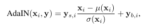
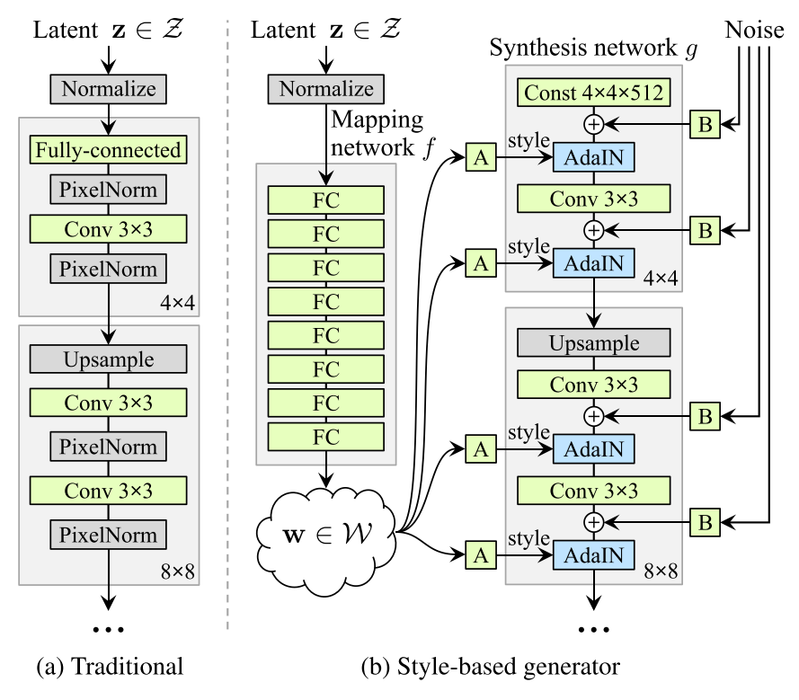
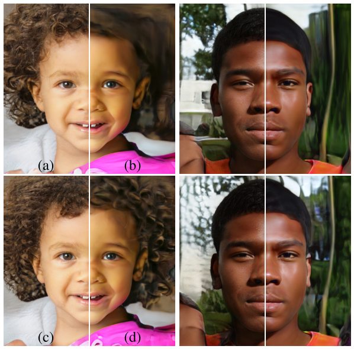
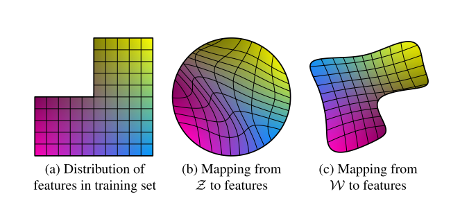
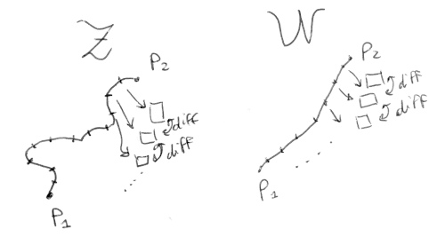
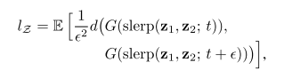
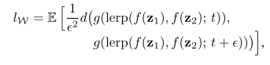
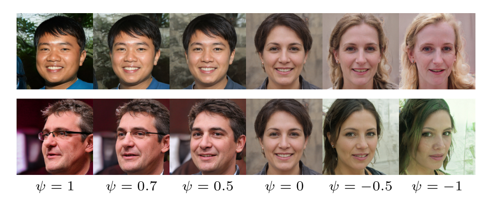

[[project](https://research.nvidia.com/publication/2019-06_A-Style-Based-Generator)] [[paper](https://arxiv.org/abs/1812.04948)] [[code](https://github.com/NVlabs/stylegan)] [[video](https://www.youtube.com/watch?v=kSLJriaOumA&feature=youtu.be)]

Inserted: 
Last revision:

# A Style-Based Generator Architecture for Generative Adversarial Networks
**Tero Karras, Samuli Laine, Timo Ailan**
 
 
This paper introduces an alternative architecture for the generator network, borrowing concepts from style transfer literature, which enable intuitive, scale specific control of the synthesis process. Furthermore, a comprehensive study of latent space disentanglement is performed, in order to demonstrate the strength of the proposed model. **Note**: the architecture of the generator heavily relies upon the progressive growing model summarized [here](Karras_2018.md). Nevertheless the original contributions of this paper are totally uncoupled with the progressive growing model, and they can be adopted in any generator architecture (:telescope: search for experiments with non-growing architectures).
- The generator takes as input a learned constant code, and adjusts the style of the image at each convolutional layer with the guidance of a latent code, which controls the strength of the image features at different scales.
- Only the latent code controls the image synthesis process, and it is inserted , with some transformations, after each convolutional layer. The latent code is not simply drawn from a given distribution, but is processed in order to be disentangled.

### Architecture

- Given a latent code _z_ in some latent space &Zscr; a non-linear mapping network (f : &Zscr; &rarr; &Wscr; ) produces _w_ &in; &Wscr;
- _w_ is then specialized by a set of learned affine transformations to a style _y_ = (ys, yb), that controls the adaptive instance normalization (AdaIN) operations, performed after each convolutional layer on the synthesis network:

  

where:\
xi = feature map\
y&#95;,i = scalar component of style _y_ &rarr; _y_ is 2*k dimensional, k = number of feature maps on the layer.

- This is similar to style transfer, but the style vector in computed from a feature vector in the latent space, and not from an image.
- Stochastic noise is added to the generator, in order to generate random details in the results (as the position of hairs, pores or freckles). The noise is a single channel "image", and it is broadcast to all the feature maps using learned per-feature scaling factors.

  

A block = affine transforms\
B blocks = learned per-channel scaling factor.

- The network does not benefit from the introduction of latent code as input. The style is solely controlled by AdaIN layers.
- The AdaIN layers perform normalization (each channel is normalized to zero mean and unit variance), and only then scales and biases based on style are performed. Each style controls only one convolution, before being overridden by the next AdaIN operator.
- Thus, the effect of a single AdaIN layer is localized in the network i.e. modifying a specific subset of the style can be expected to affect only certain aspects of the image. Moreover, since the architecture exploits progressive growing, AdaIN layers localized in the first convolutional layers are responsible for the global style of the image (e.g. pose, sex), while AdaIN layers located in the high resolution part of the model are responsible of finer style characteristics, such as hair or skin color.

### Stochastic variation
- Many aspects of human portraits can be regarded as stochastic, such as the placement of hairs, pores, freckles...
- StyleGAN adds per-pixel noise after each convolution. The noise only affects stochastic aspects of the result, leaving the overral structure and composition invariant and intact.
- The effect of noise is localized in the network. This is hypothesized to be guided by the fact that the generator has some "pressure" to introduce new content, as soon as new information is provided to the network. Hence, the easiest way to create stochastic variation is to rely on the introduced noise.

  

Effect of noise inputs at different layers of the generator. (a) Noise is applied to all layers. (b) No noise. (c) Noise in fine layers only (642 – 10242). (d) Noise in coarse layers only (42 – 322). It can be seen that the artificial omission of noise leads to featureless “painterly” look. Coarse noise causes large-scale curling of hair and appearance of larger background features, while the fine noise brings out the finer curls of hair, finer background detail, and skin pores.

### Disentanglement
- A disentangled latent space is the preferred goal of every generative model. A disentangled space is composed of linear subspaces, each of which controls a factor of variation. However, the sampling probability of every combination of factors in &Zscr; needs to match the corresponding density in the training data. E.g. if we have only two independent factors of variation: hair color and height, a 2D latent space should model hair color in one dimension, and height in the other. At the same time, the sampling probability in &Zscr; has to respect the training set distribution. If very few people in the dataset have brown hair and are very high, the latent space sampling should embed this property, assigning low probability to the latent space sub-region that identifies tall brown-haired people.
- The mapping from &Zscr; to &Wscr; is benefical, because the intermediate latent space &Wscr; does not have to support sampling according to any fixed distribution. The mapping can be used to "unwarp" &Wscr; so that the factor of variations become linear, and more similar to the distribution of feature in the training set.

  

### How to quantify entanglement without remap images to latent space
**Perceptual path length**
- Interpolation of latent space can yield surprisingly results, e.g. features not present in the two endpoints can magically appear in the middle of the interpolation path (this is because the space is entangled).
- If an interpolation between two points in the latent space is performed, and then the image distance is calculated (after transforming the latent codes to images), we could estimate the linearity of the latent space.

If we divide the interpolation in smaller and smaller segments, we can estimate the path length. The authors take &epsilon; = 10-4 as minimum length. The metric is calculated on 100,000 samples, and using &Wscr; space considerably shortened the perceptual path length.
- The formulas used for calculating the perceptual path length are:

where:\
z1, z2 ~ P(z)\
_t_ ~ U(0,1)\
_d_(&middot;, &middot;) evaluates the perceptual distance between 2 images\
slerp = spherical interpolation\
lerp = linear interpolation

**Linear separability**
- If the latent space is sufficiently disentangled, it should be possible to find vectors that consistently corresponds to individual features of variations.
- The proposed metric quantify the separation, calculating how well the latent space points can be separated into two distinct sets via _linear_ hyperplane. Each set corresponds to a specific binary attribute of the image (e.g. male/female).
- First, a SVM is trained to distinguish between points in the latent space (both in &Zscr; and &Wscr; ) and a pretrained classifier is used to classify images based on 40 attributes. The metric is defined as:

exp(&Sigma;i H(Yi | Xi) )

  where:\
  i are the 40 attributes\
  X are the classes predicted by the SVM for the i-th attribute\
  Y are the classes predicted by the pre-trained classifier.\
  H(&middot;|&middot;) is the conditional entropy ([wiki](https://en.wikipedia.org/wiki/Conditional_entropy), [blog post](https://math.stackexchange.com/questions/770709/understanding-conditional-entropy-intuitively-hyx-x-vs-hyx))

- This metric tells how much additional information is required to determine the true class of a sample given that it is known in which side of the hyperplane it lies (calculated by the SVM).

### Truncation trick in &Wscr;
- If the distribution of training data is considered, it is clear that areas of low density are poorly represented and thus likely to be difficult for the generator to learn. This is still a significant open problem in all generative models.
- It is known that drawing latent vectors from a truncated, or shrunk latent space tends to improve image quality, at the cost of some variation loss.
- A similar strategy is followed, first calculating the center of mass of &Wscr; as w&#772; = &Eopf;z~P(z)(_f_(z)). In case of faces dataset, this represents a sort of average face. The deviation of a given w from the center can be scaled as w' = w&#772;+ _&psi;_(w − w&#772;), where _&psi;_ < 1.

The effect of truncation trick as a function of style scale _&psi;_. When we fade _&psi;_ &rarr; 0, all faces converge to the “mean” face. This face is similar for all trained networks, and the interpolation towards it never seems to cause artifacts. By applying negative scaling to styles, we get the corresponding opposite or _anti-face_. It is interesting that various high-level attributes often flip between the opposites, including viewpoint, glasses, age, coloring, hair length, and often gender.

### Discussion
- Style-based image synthesis is in every way superior to traditional GANs generators, in the field of image synthesis. This is proved in terms of established quality metrics, in many generations task (faces, bedrooms, ...)
- The main reasons for this superior performance are the separation of high-level attributes and stochastic effects
  - Style is inserted throughout the network, and based on the insertion position it controls only some attributes of the image. Stochastic effects such as hairs position are leaved to random noise inserted after each convolution.
- Another reason of the model superiority is the linearity of the intermediate latent space &Wscr;. In particular, the disentangled latent space improves the understanding and controllability of GAN synthesis.
- The proposed average path length metric could be used as a regularizer during training, since more linear latent space yields better results.
