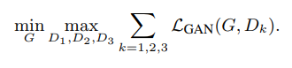

[[project](https://tcwang0509.github.io/pix2pixHD/)] [[paper](https://arxiv.org/abs/1711.11585)] [[code](https://github.com/NVIDIA/pix2pixHD)] [[video](https://www.youtube.com/watch?v=3AIpPlzM_qs&feature=youtu.be)]

Inserted: _11 Jul 2019_ \
Last revision: _11 Jul 2019_

# High-Resolution Image Synthesis and Semantic Manipulation with Conditional GANs
**Ting-Chun Wang, Ming-Yu Liu, Jun-Yan Zhu, Andrew Tao, Jan Kautz, Bryan Catanzaro**
 
 
Novel method to generate high resolution images that are realistic and can be edited at inference time.\
**Note**: the model described in this paper heavily relies on the [pix2pix](https://phillipi.github.io/pix2pix/) model. Indeed, this paper is an extension of the aforementioned pix2pix model, developed with the aim of generating HD images (10242 and above).

Three main contributions:
1. a novel adversarial loss.
2. a new multiscale generator and discriminator architecture
3. object instance segmentation information included in the model (mainly for label-to-image mapping).

### Coarse to fine generator
- The generator G is decomposed into two sub-networks: G1 and G2. G1 is trained as the global generator, and G2 as the local enhancer network. G1 operates at image size of 1024x512 while G2 works with a 4x resolution (2x along each axis).
- The global generator G1 is the same as pix2pix or cycleGAN ([Johnson _et al._ architecture](https://arxiv.org/abs/1603.08155)). It can be further divided in three components: a convolutional frontend G1F, a set of residual blocks G1R, and a convolutional backend G1B. The same division can be done for G2.
- The input of G2R is the element-wise sum of two feature maps: the output feature vector of G2F and the last feature map of G1B.

First, the network G1 is trained alone, and then the local enhancer(s) are trained in the order of their resolution (more than one enhancer network could be present). I.e. when G2 is trained, the weight of G1 are not updated. At the end of the training of each network, all the networks are fine-tuned together.

### Multiscale discriminator
- High resolution image synthesis posed a significant challenge in GAN discriminator design, since working with high resolution (thus very high dimensional data) means that the discriminator has to have a large receptive field. But a large receptive field is prone to concentrate only on large structures of the image, and not on the details.
- The authors proposed a multi-scale discriminator with three different discriminators at different image scales. The real and synthesized images are downsampled by a factor of 2 and 4, in order to create an image pyramid of three scales.
- The discriminator that operates at the coarsest scale has the largest receptive field (the three discriminators have the same architecture, but smaller images &rarr; more portion of the image in the receptive field). The discriminator that operates at the coarsest size has a more global view of the image, and can guide the generator to output globally consistent images (e.g. global shapes of objects). On the other hand, the discriminator that operates at the finest scale encourage the generation of finer details (e.g. sharper borders, small details).
- Without multi-discriminator many repeated patterns are often observed in the generated images.
- The adversarial loss of the model now is defined as:

 

- where:
  - s = image domain 1
  - x = ground truth real mapping

### Improved adversarial loss
- In pix2pix the adversarial loss is improved by a L1 loss between the generated image and the ground truth. This may lead to blurry results, thus the adversarial loss is often preferred (especially with high resolution images).
- The adversarial loss (or GAN loss, _L_GAN) can be improved by a feature-matching loss based on the discriminator. This loss stabilize the training, because the generator has to produce natural statistics at multiple scales in order to fool the discriminator (multi-scale because a multi-scale discriminator is used, see previous section). The loss is defined as:

- where:
  - T is the total number of layers on the discriminator
  - _D__k__(i)_ is the _i_-th layer of the discriminator _D__k_
  - _N__i_ denotes the number of elements in each layer (number of neurons)

- This loss is related to perceptual loss, and in its calculation _D__k_ serves only as a feature extractor, so its weight are not modified by the gradient accumulated from _L_FM.

### Additional tricks

**Using instance maps**
- The semantic label map only contains information on the classes of the objects, without differentiate between single objects of the same category. This is particularly problematic if many objects of the same category are next to one another. Only looking at the semantic label map it is impossible to tell them apart.
- To extract information, the instance boundary map is computed, and then concatenated with the one-hot representation of the semantic label map.
  - One-hot representation of a semantic label map &rarr; if we have _k_ classes, the label map is decomposed into _k_ channels, each of them representing a class. If the channel 4 represents cars, it contains 1 in the locations where cars are present, and 0 otherwise.  

   
  

**Learning an instance level feature embedding**
- The translation from semantic label to images is a one-to-many mapping problem, and an ideal model should be able to translate the same label map to different realistic images.
- An additional low-dimensional feature channel is used as input for the generator.
  - The features are generated through an encoder _E_, trained jointly with generator and discriminators. An instance wise average pooling layer is added to the output of the encoder in order to compute the average feature for the object instance. The average feature is then broadcasted to all pixel locations of the instance.
- Once the encoder is trained, all the training images are encoded through it, and the correspondent feature vectors are obtained. Then, the feature vectors are clustered with a K-mean clustering method for each semantic category (e.g. street in asphalt or cobblestones). Each cluster thus encodes the features for a specific style.
- At inference time one of the cluster centers is randomly picked and used as additional input to the generator.

  

### Discussion
- This paper introduces an extension of the pix2pix model in order to deal with high-resolution images. The mapping is performed in the same way, and the full resolution is reached concatenating two or more models together.
- A multi-discriminator strategy is adopted, in order to reduce mode collapse. Mode collapse is an effect of the limited receptive field (with respect to the whole image) of the patchGAN discriminator. Using few identical discriminators with different image scales helps to mitigate this problematic.
- For producing better results, especially in the class labels to images mapping, the instance map (composed of the boundaries of the single objects in the image) is added to the generator. This helps the generator to distinguish objects of the same class, especially if they are close to each others.
- To perform a one-to-many mapping an instance-level feature embedding is adopted. The feature extractor is trained jointly with the GAN, and at the end of the training all the feature maps of the training images are collected. Using a clustering algorithm to cluster the features map around each semantic category. At inference time a centroid of a cluster is added to the input of the generator, in order to apply a characteristic style.

- _Can this model be adapted to work with unpaired data (like a cycleGAN HD)?_
