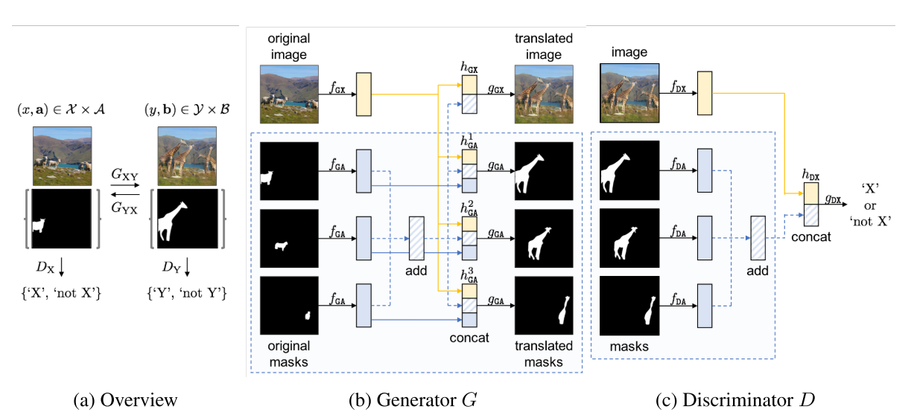
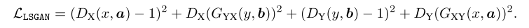
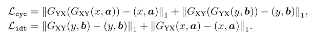
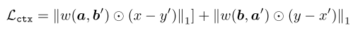
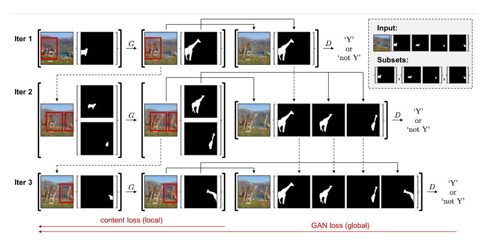

[[paper](https://arxiv.org/abs/1812.10889)] [[code](https://github.com/sangwoomo/instagan)] [[video](https://www.youtube.com/watch?v=WpV5Ttbbzh0)]

Inserted: _16 Jul 2019_  
Last revision: _16 Jul 2019_

# InstaGAN: Instance-aware Image-to-Image Translation
**Sangwoo Mo, Minsu Cho, Jinwoo Shin**
 
 
- Image-to-image translation methods failed when in the same image are present multiple instances to translate, e.g. many horses to be translated into zebras; or the translation involves significant changes in shape, e.g. translating from sheep to giraffes.
- InstaGAN (instance-aware GAN) incorporates instance information in order to promote multi instance transfiguration and to increase the accuracy on shape translation. &rarr; instance information is modeled by an object segmentation map (each object in the scene has its "personal" segmentation map).
- InstaGAN translates both the original image and the corresponding set of instance attributes.
- Including shape information (given as instance information) is effective for shape transformation, and this property should be useful to other related researches in the future.
- Three main contribution:
  - A network that translates both images and instance attributes at the same time
  - A context preservation loss that encourages the network to focus on target instances in translation, and learn the identity function outside of them.
  - A new sequential mini-batch inference/training technique, in order to handle a large number of instances with limited GPU memory.

### InstaGAN: idea and architecture
- Given two domains, an image-to-image translation model learns a map GXY : &Xscr; &rarr; &Yscr; and/or the inverse mapping GYX : &Yscr; &rarr; &Xscr;
- The main idea of instaGAN is to incorporate additional instance information, e.g. &Ascr; to &Xscr; and &Bscr; to &Yscr;
- The set of instance attributes &ascr; &in; &Ascr; comprises all the _N_ target instances present in an image &xscr; &in; &Xscr; , so &ascr; = { ai }_N_i=1.
- The goal is to learn the mapping _M_ : ( &Xscr; x &Ascr; ) &rarr; ( &Yscr; x &Bscr; ). This leads to disentangle defferent instances in the images.

**Architecture**

  

The generator G is composed of two networks: an image translator GX and an instance translator GA.

1. First a feature extractor is used (the feature extractor is a part of G) to extract features from the original image (fGX) and the instances (fGA).
2. Instance features are added together, and a concatenation between the original image features and the sum of instances features is used as latent vector for the original image (hGX). The latent vector of the instances is enriched with the feature vector of the original instance (hkGA).
3. A decoder is used to perform the mapping, transforming latent vectors into translated images. The original image is translated by the gGX decode, while the instance are translated by gGA.
4. The same procedure described in point 2. is used to produce hDX, which is then given as input to the discriminator gDX to perform the real/fake classification.

This quite complex architecture and feature encoding is performed in order to assure that the model is permutation-invariant regarding instances. i.e. the order of instances cannot change the final result (see [Zaheer _et al._](https://arxiv.org/abs/1703.06114)).

**Losses**
- GAN or adversarial loss (squared loss is used, since it has shown a stably good performance in image-to-image translation tasks).

  

- Content loss (cycle-consistency loss + identity loss. See [Zhu _et al._](https://arxiv.org/abs/1703.10593)).

  

- Newly proposed context preserving loss, with the aim of enforcing to translate instance only, maintaining the background untouched. Backgrounds of two domains in a transfiguration mapping can be different (e.g. an instance is enlarged or shrunk during translation, covering or revealing new background). In the loss, the non-zero weight is considered only if a pixel is in the background in both the original and the translated image.

  

- where:
  - &#x2609; is the element-wise product.
  - w(a, b) is one minus the element-wise minimum of binary represented instance masks (zero in the instances, a weight _w_ in the background).

### Sequential minibatch translation
- The proposed architecture is, in theory, able to translate an arbitrary number of instances (no bounds on the number of distinct instances to be translated in the same image), but the GPU memory required linearly increase with the number of instances.
- In the paper is presented a technique to train an arbitrary number of instances without increasing the GPU memory utilization.

  

The procedure is the following:

1. The set _a_ of instances is divided into M minibatches a1, ..., aM so that _a_ = &Union;i ai and ai &Intersection; aj = &emptyset; if i &ne; j.
2. At the _m_-th iteration (for _m_ = 1..M) the pair composed of an image and a minibatch of masks (x_m_, a_m_) is translated, where x_m_ is the translated y_m_-1 image at the previous iteration (x1 = x).
3. At each iteration, the generator G outputs an intermediate translated image y'_m_, which accumulates all the minibatches translations up to the current iteration.
  - E.g. if we have the situation described in the figure above, four instances are divided into three minibatches of one, two and one instance respectively, so M = 3. At the first iteration, the couple (x1 = x, a1) is translated, and the resulting image y'1 has only one instance translated: the one represented by the mask in a1. At the second iteration, we translate the couple (x2 = y'1, a2). The resulting image y'2 has three instance translated (the one translated in the previous iteration and the two translated in the last iteration). The same for the third and last iteration, when finally the final mapping is obtained.

- The content loss is applied to the intermediate samples (x_m_, a_m_) and G(x_m_, a_m_) = (y_m_, b_m_). The GAN loss is applyed to the aggregate minibatches (x, a) and (y_m_, b1:_m_), thus the translated masks at previous iterations are copied, in order to calculate the GAN loss.
- The proposed approach also improve translation of images with few instances, due to the data augmentation effect using intermediate samples (x_m_, a_m_).

### Discussion
- The model was trained on many transfiguration tasks, such as jeans to skirt or sheep to giraffe, showing significant better results than cycleGAN.
- The model can handle the translation of many instances in the same image, without requiring a huge quantity of GPU memory. However, training images were resized to a maximum size of 300x200 pixels. It is unclear from the paper if this heavy resize is necessary due to computing limitation or model limitation, though I believe that the former reason is the most probable.
- InstaGAN is a significant improvement in object shape transfiguration. In many previous models of image-to-image translation, a considerable change in shape between objects to be translated has always been a major issue. The insertion of instance masks in the model greatly improve shape transfiguration, at the cost of doubling model size (another translation model is required to translate masks).

**Final considerations**
- The model shows remarkable results, but the field of image transfiguration is still developing.
- The model can only handle low resolution images (maybe due to memory and GPU power limitations).
- The model can only handle images, it would be interesting to test the model (with some modifications) on video streams.
- A super-interesting idea is to develop something like [starGAN](https://arxiv.org/abs/1711.09020), but for multi-domain instance transfiguration, i.e. translating the instances in the same image into different domains. As an example, an image that contains three horses might be translated into an image that contains a zebra, a lion and a giraffe.
