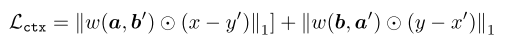

[[paper](https://arxiv.org/abs/1812.10889)] [[code](https://github.com/sangwoomo/instagan)] [[video](https://www.youtube.com/watch?v=WpV5Ttbbzh0)]

Inserted: 
Last revision:

# InstaGAN: Instance-aware Image-to-Image Translation
**Sangwoo Mo, Minsu Cho, Jinwoo Shin**
 
 
- Image-to-image translation methods failed when in the same image are present multiple instances to translate, e.g. many horses to be translated into zebras; or the translation involves significant changes in shape, e.g. translating from sheep to giraffes.
- InstaGAN (instance-aware GAN) incorporates instance information in order to promote multi instance transfiguration and to increase the accuracy on shape translation. &rarr; instance information is modeled by an object segmentation map (each object in the scene has its "personal" segmentation map).
- InstaGAN translates both the original image and the corresponding set of instance attributes.
- Including shape information (given as instance information) is effective for shape transformation, and this property should be useful to other related researches in the future.
- Three main contribution:
  - A network that translates both images and instance attributes at the same time
  - A context preservation loss that encourages the network to focus on target instances in translation, and learn the identity function outside of them.
  - A new sequential mini-batch inference/training technique, in order to handle a large number of instances with limited GPU memory.

### InstaGAN: idea and architecture
- Given two domains, an image-to-image translation model learns a map GXY : &Xscr; &rarr; &Yscr; and/or the inverse mapping GYX : &Yscr; &rarr; &Xscr;
- The main idea of instaGAN is to incorporate additional instance information, e.g. &Ascr; to &Xscr; and &Bscr; to &Yscr;
- The set of instance attributes &ascr; &in; &Ascr; comprises all the _N_ target instances present in an image &xscr; &in; &Xscr; , so &ascr; = { ai }_N_i=1.
- The goal is to learn the mapping _M_ : ( &Xscr; x &Ascr; ) &rarr; ( &Yscr; x &Bscr; ). This leads to disentangle defferent instances in the images.

**Architecture**

  

The generator G is composed of two networks: an image translator GX and an instance translator GA.

1. First a feature extractor is used (the feature extractor is a part of G) to extract features from the original image (fGX) and the instances (fGA).
2. Instance features are added together, and a concatenation between the original image features and the sum of instances features is used as latent vector for the original image (hGX). The latent vector of the instances is enriched with the feature vector of the original instance (hkGA).
3. A decoder is used to perform the mapping, transforming latent vectors into translated images. The original image is translated by the gGX decode, while the instance are translated by gGA.
4. The same procedure described in point 2. is used to produce hDX, which is then given as input to the discriminator gDX to perform the real/fake classification.

This quite complex architecture and feature encoding is performed in order to assure that the model is permutation-invariant regarding instances. i.e. the order of instances cannot change the final result (see [Zaheer _et al._](https://arxiv.org/abs/1703.06114)).

**Losses**
- GAN or adversarial loss (squared loss is used, since it has shown a stably good performance in image-to-image translation tasks).

  

- Content loss (cycle-consistency loss + identity loss. See [Zhu _et al._](https://arxiv.org/abs/1703.10593)).

  

- Newly proposed context preserving loss, with the aim of enforcing to translate instance only, maintaining the background untouched. Backgrounds of two domains in a transfiguration mapping can be different (e.g. an instance is enlarged or shrunk during translation, covering or revealing new background). In the loss, the non-zero weight is considered only if a pixel is in the background in both the original and the translated image.

  

- where:
  - &#x2609; is the element-wise product.
  - w(a, b) is one minus the element-wise minimum of binary represented instance masks. 
